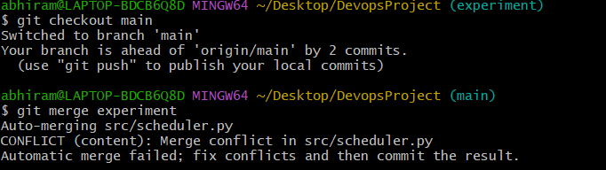

# 🧠 Disk Scheduling Simulator (Version Control Systems – Git Bash & GitHub Project)

## 📌 Project Description

This project is a Git-centric university assignment developed as part of the **Version Control Systems** course.  
The main objective of the project is to demonstrate **practical usage of Git and GitHub** through a structured and disciplined version control workflow.

A Python-based **Disk Scheduling Simulator** was developed as the application layer to clearly showcase:

- Incremental development using commits
- Feature isolation using multiple branches
- Branching and merging workflows
- Intentional merge conflict creation and resolution
- Proper project documentation using Markdown

The primary focus of evaluation is **version control practices**, not the complexity of the application logic.

## 🛠️ Technologies Used

- Git Bash – Local version control operations
- GitHub – Remote repository and branch management
- Python – Disk scheduling application implementation
- Markdown – Project documentation (README.md)

## 🌿 Git Workflow Used

The project follows a **branch-based Git workflow**:

- The `main` branch contains stable and final project code
- Separate branches were created for feature development, testing, bug fixing, and experimentation
- Each branch was worked on independently and later merged into `main`
- All changes were committed with meaningful messages before pushing to GitHub

This workflow ensures clean code history, better tracking of changes, and controlled integration.

## 🔀 Branches Created

The following branches were created and used in the project:

- `feature` – For feature-related changes
- `test` – For testing-related updates
- `bugfix` – For fixing issues
- `experiment` – For experimental changes

Each branch served a specific purpose and helped in isolating changes during development.

## 🧾 Git Operations Performed

The following Git operations were performed throughout the project:

- Repository cloning using `git clone`
- Checking repository status using `git status`
- Staging changes using `git add`
- Creating meaningful commits using `git commit`
- Creating and switching branches using `git branch` and `git checkout`
- Merging branches using `git merge`
- Demonstrating and resolving a real merge conflict manually
- Pushing code to GitHub using `git push`

## 📸 Project Execution Screenshots

### 🧩 Creating Python Files
This screenshot shows the creation of Python source files inside the `src` directory.  
It represents the initial setup and modular structure of the project.

---

### 🧾 Initial Commit
This screenshot shows the first commit after adding the project files to Git.  
The initial commit establishes the base version of the project.

---

### 🌿 Branch Creation
This screenshot shows the creation of multiple branches such as feature, test, bugfix, and experiment.  
Branches help in isolating development and testing activities.

---

### 🔥 Merge Conflict Occurred
This screenshot shows a merge conflict while merging the `experiment` branch into `main`.  
The conflict occurred because the same file was modified in both branches.

---

### ✅ Merge Conflict Resolved
This screenshot shows the conflict after it was manually resolved and committed.  
The successful commit confirms proper conflict resolution.

### 📊 Git Commit History Graph
This screenshot shows the complete Git commit history using  
`git log --graph --oneline --all`.

It visually represents multiple branches, commits, and merge operations,
demonstrating proper Git branching and version control workflow.

## 🏁 Conclusion

This project helped in understanding Git and GitHub through practical usage of commits, branches, merges, and conflict resolution.  
It provided real-world exposure to version control workflows and proper project documentation.
